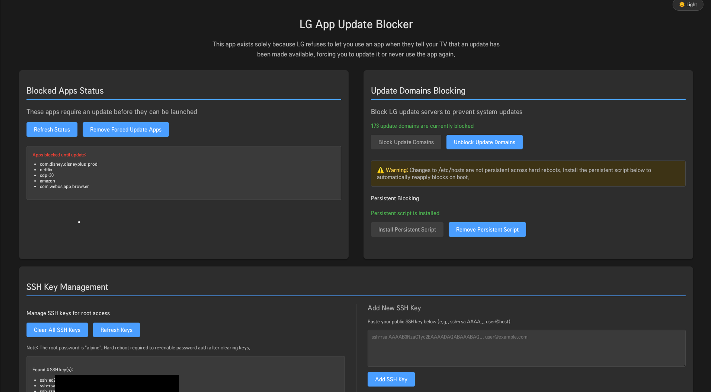

# lgappupdateblocker

This is some AI slop that I vibecoded because LG wouldnt let me open the web browser without updating, and I didnt want to unblock their update servers. 🙃

Allows you to bypassed the coerced updates. Without this, when LG passes an update down, you cannot launch the app without updating it, or you will get this message

> You must update this app to launch it. This update may cause stored data to be deleted. Do you want to update this app?



## The [homebrew channel](https://github.com/webosbrew/webos-homebrew-channel/) with root access is required for this to work!

## How to build

Run the following commands (assuming NPM is installed):

```
npm install
npm run build
npm run package
```

And deploy it to your tv with:
```
ares-install org.webosbrew.appupdateblocker_1.0.0_all.ipk
ares-launch org.webosbrew.appupdateblocker
```

## How to install

Run `ares-install org.webosbrew.appupdateblocker_1.0.0_all.ipk` to install the app on your webOS device.

To remove it, run `ares-install -r org.webosbrew.appupdateblocker`

Then to launch the app, run `ares-launch org.webosbrew.appupdateblocker`.


## other stuff

In case something screws up, here's the original hosts file:
```
127.0.0.1       localhost.localdomain           localhost

# The following lines are desirable for IPv6 capable hosts
::1     localhost ip6-localhost ip6-loopback
fe00::0 ip6-localnet
ff00::0 ip6-mcastprefix
ff02::1 ip6-allnodes
ff02::2 ip6-allrouters

# This file is dynamically regenerated on boot by webosbrew startup script
127.0.0.1 snu.lge.com su-dev.lge.com su.lge.com su-ssl.lge.com
::1 snu.lge.com su-dev.lge.com su.lge.com su-ssl.lge.com
```

## Dev testing

You can hit the individual endpoints over ssh like this (obviously replace the IP with your tv's IP):

```bash
ssh root@10.1.0.123 -C 'luna-send -n 1 "luna://org.webosbrew.appupdateblocker.service/readUpdateInfo" "{{}}"'
```

## Acknowledgements

[Simon34545](https://github.com/Simon34545/lginputhook) - I ripped a lot of code from him
